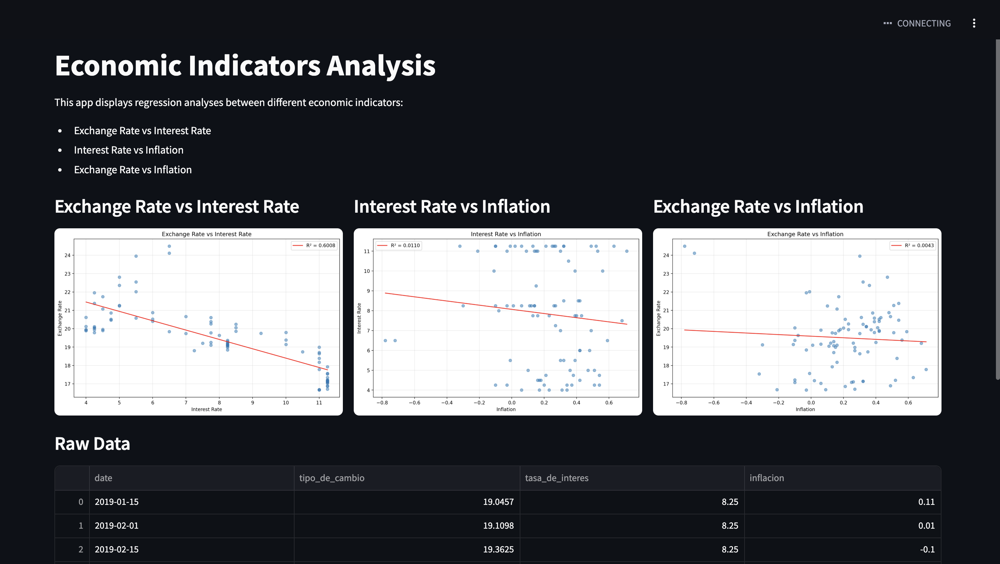

# Economic Data Downloader

This project contains scripts to download economic data from Banxico and INEGI.

## Project Structure

```
Tarea06/
├── src/
│   ├── banxico/
│   │   └── get_banxico_files.py
│   └── inegi/
│       └── get_inegi_files.py
├── data/
│   ├── banxico/
│   └── inegi/
├── config/
│   └── config.yaml
├── requirements.txt
└── README.md
```

## Setup

1. Create a virtual environment:
```bash
python -m venv .venv
source .venv/bin/activate 
```

2. Install dependencies:
```bash
pip install -r requirements.txt
```

3. Configure your API tokens:
   - Edit `config/config.yaml` and add your Banxico token
   - The INEGI token is already configured

## Usage

### Download Banxico Data

To download exchange rate and interest rate data from Banxico:

```bash
python src/banxico/get_banxico_files.py
```

This will save the following files in `data/banxico/`:
- `tipo_cambio.csv`: Daily peso/USD exchange rate
- `tasa_interes.csv`: Interbank equilibrium interest rate

### Download INEGI Data

To download inflation data from INEGI:

```bash
python src/inegi/get_inegi_files.py
```

This will save the following file in `data/inegi/`:
- `inflacion.csv`: General inflation rate

## Data Format

All data files are saved in CSV format with the following columns:
- `date`: Date of the observation
- `value`: The corresponding economic indicator value 


## Run the streamlit app

```bash
cd src/app && streamlit run app.py
```

You should visualize something like this: 


